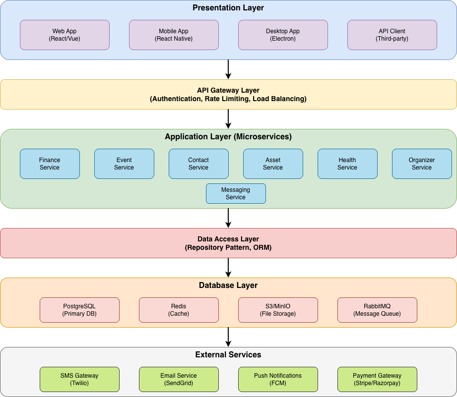

# Griham - Home Automation System

A comprehensive home management platform to track and organize all aspects of household life including finances, events, contacts, assets, health, and more.

## 📚 Documentation

Detailed documentation for each module:

- [System Architecture](docs/ARCHITECTURE.md) - System design, technology stack, and patterns
- [Finance Module](docs/FINANCE.md) - Income, expenses, bills, investments, savings
- [Events Module](docs/EVENTS.md) - Birthdays, anniversaries, cultural events
- [Contacts Module](docs/CONTACTS.md) - Family, neighbors, vendors
- [Assets Module](docs/ASSETS.md) - Property, vehicles, gadgets, documents
- [Health Module](docs/HEALTH.md) - Medical records, appointments, vaccinations
- [Organizer Module](docs/ORGANIZER.md) - Tasks, notes, shopping lists
- [Messaging Module](docs/MESSAGING.md) - Internal messaging and notifications

---

## 🏗️ System Architecture



---

## 🎯 Core Modules

1. **Finance Track** - Income, expenses, cards, bills, investments, savings, transactions
2. **Event Track** - Birthdays, anniversaries, cultural events with reminders
3. **Contacts** - Family, neighbors, vendors with emergency contacts
4. **Assets** - Property, vehicles, gadgets, documents with expiry tracking
5. **Health** - Medical records, vaccinations, appointments, prescriptions
6. **Organizer** - Tasks, notes, shopping lists, reminders
7. **Messaging** - Internal messaging, notifications, alerts

---

## 🚀 Getting Started

### Prerequisites
- PHP 8.1+
- MySQL 5.7+
- Node.js 18+
- Composer

### Quick Start

```bash
# Clone repository
git clone https://github.com/yourusername/griham.git
cd griham

# Setup backend
cd backend
composer install
cp .env.example .env
# Edit .env with your database credentials
php database/migrate.php

# Setup frontend
cd ../frontend
npm install

# Start both servers
cd ..
./start-dev.sh
```

### Access Application
- Frontend: http://localhost:3000
- Backend API: http://localhost:8000/api

### Test Credentials
- Email: `admin@griham.com`
- Password: `admin123`

---

## 📋 Implementation Phases

- **Phase 1** (Weeks 1-2): Foundation & User Management
- **Phase 2** (Weeks 3-5): Finance Module
- **Phase 3** (Weeks 6-7): Event & Contact Modules
- **Phase 4** (Weeks 8-9): Asset Module
- **Phase 5** (Weeks 10-11): Health Module
- **Phase 6** (Weeks 12-13): Organizer & Messaging
- **Phase 7** (Weeks 14-16): Advanced Features
- **Phase 8** (Weeks 17-18): Testing & Deployment

---

## 🤝 Contributing

1. Fork the repository
2. Create feature branch (`git checkout -b feature/AmazingFeature`)
3. Commit changes (`git commit -m 'Add AmazingFeature'`)
4. Push to branch (`git push origin feature/AmazingFeature`)
5. Open Pull Request

---

## 📝 License

This project is licensed under the MIT License - see the LICENSE file for details.

---

## 📧 Contact

Project Link: [https://github.com/yourusername/griham](https://github.com/yourusername/griham)


Summary of changes:

## Mirage updates

### 1. **Three fixed dummy users** (any password works in Mirage)

| Email | Name        | System role | Purpose |
|-------|-------------|------------|--------|
| **root@griham.local**  | Root User   | `root`  | Root admin: sees Permissions, Roles, Groups and can manage RBAC. |
| **admin@griham.local** | Admin User  | `admin` | Main app + household/finance; has RBAC role “Finance Manager”. |
| **user@griham.local**  | Normal User | `user`  | Main app; has RBAC role “Viewer”. |

Mirage does not validate passwords; you can use e.g. **password123** for all three.

### 2. **Seed data**

- **Users:** Root, Admin, and Normal User with fixed IDs so RBAC assignments are stable.
- **Household:** One household owned by the admin user (accounts, transactions, bills, cards) so admin and normal user can test family/finance.
- **RBAC:**
  - **Roles:** “Finance Manager”, “Viewer”.
  - **Permissions:** `finance.accounts.read`, `finance.accounts.write`, `finance.bills.manage`.
  - **Role → permissions:** Finance Manager has all three; Viewer has read only.
  - **User → roles:** Admin has Finance Manager; Normal User has Viewer.
  - **Group:** “Finance Team” with admin as member and Finance Manager as group role.

### 3. **How to test**

1. Run the app with Mirage (no `VITE_API_URL` or point to Mirage).
2. **Root:** Log in as **root@griham.local** / password123 → you should see the root sidebar (Permissions, Roles, Groups) and full RBAC UI.
3. **Admin:** Log in as **admin@griham.local** / password123 → main app (Dashboard, Family, Finance, etc.) and in `/auth/me` the user has `rbac_roles: [{ name: 'Finance Manager', ... }]`.
4. **Normal user:** Log in as **user@griham.local** / password123 → main app with `rbac_roles: [{ name: 'Viewer', ... }]`.

Comments in `server.ts` above the seed users list these three accounts and that any password (e.g. password123) can be used for testing.
