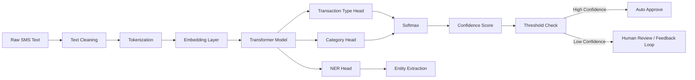
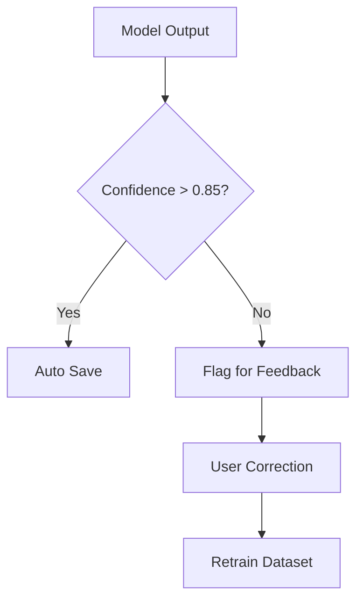

# 🔥 AI Classification Flow Diagram

**(Production-Grade Financial SMS Parser)**

---

## 🧠 End-to-End AI Classification Flow


---

## 🏗️ 1️⃣ High-Level AI Flow (System View)

```mermaid
flowchart TD
    A[Mobile App] --> B[SMS Ingestion API]
    B --> C[Message Queue (Kafka)]
    C --> D[Preprocessing Service]
    D --> E[Rule Engine]
    E -->|Matched| F[Structured Transaction]
    E -->|No Match| G[ML Classification Service]
    G --> H[Entity Extraction]
    H --> I[Category Prediction]
    I --> J[Confidence Scoring]
    J --> K[Transaction DB]
    J --> L[Audit Logs]
```

---

# 🧠 2️⃣ Detailed AI Classification Flow (Internal ML Pipeline)



---

# ⚙️ 3️⃣ Processing Stages Explained

## 🔹 Stage 1: Preprocessing

* Normalize currency symbols (₹, INR, Rs.)
* Standardize date
* Remove noise words
* Lowercase normalization
* Mask account numbers

---

## 🔹 Stage 2: Rule Engine (Fast Path)

If regex match:

```regex
INR\s([\d,]+\.\d{2}).*(credited|debited).*(UPI|P2M)
```

→ Direct structured extraction
→ Skip ML
→ Confidence = 1.0

---

## 🔹 Stage 3: ML Classification (Fallback Path)

Model Inputs:

```json
{
  "text": "INR 1900.00 credited ... SRI KAUVERY MEDICAL"
}
```

Model Outputs:

```json
{
  "transaction_type": "UPI_P2M",
  "category": "MEDICAL",
  "amount": 1900.00,
  "confidence": 0.94
}
```

---

# 🧩 4️⃣ Multi-Head Architecture (Recommended)

Instead of separate models, use:

```
Shared Transformer Encoder
        ↓
 ┌──────────────┬──────────────┬──────────────┐
 Transaction    Category       NER
 Type Head      Head           Head
```

Benefits:

* Faster inference
* Shared contextual understanding
* Lower infrastructure cost

---

# 🎯 5️⃣ Confidence-Based Routing



---

# 🔁 6️⃣ Active Learning Loop

1. Low-confidence SMS stored
2. User corrects category
3. Store correction
4. Add to training dataset
5. Weekly retraining job
6. Deploy new model version

---

# 🚀 7️⃣ Production Enhancements

| Feature             | Implementation            |
| ------------------- | ------------------------- |
| Batch inference     | GPU inference service     |
| Real-time inference | REST microservice         |
| Model versioning    | MLflow                    |
| Feature store       | Redis                     |
| Drift detection     | Data distribution monitor |
| Explainability      | SHAP values               |

---

# 🏆 Final Production-Ready AI Stack

| Layer      | Tech Option           |
| ---------- | --------------------- |
| Queue      | Kafka                 |
| Inference  | FastAPI + Torch       |
| Model      | DistilBERT fine-tuned |
| Storage    | Postgres              |
| Search     | Elastic               |
| Cache      | Redis                 |
| Monitoring | Prometheus            |

---

If you want next:

* 🔥 Kubernetes deployment diagram
* 🧠 Model training pipeline diagram
* 📊 Sequence diagram
* 📦 Complete LLD with class diagrams
* 🎯 System design interview version

Tell me which direction you want 🚀
