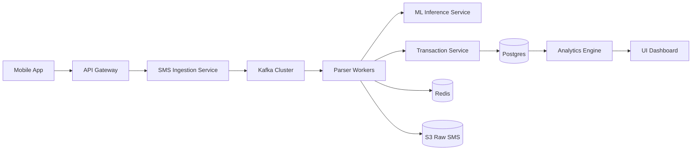
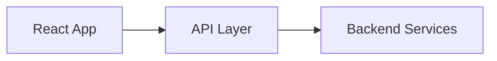
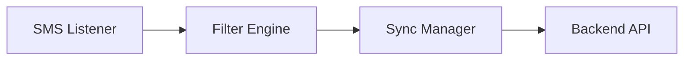

This is a **real CTO-level execution blueprint**.

You have:

* 3 Teams:

  * 🎨 UI Team
  * ⚙️ Backend Team
  * 📱 Mobile Team
* 3 Project Managers (1 per team)
* 2-Year Timeline
* Goal: Production-grade AI Financial SMS Intelligence Platform

This will cover:

1. Product Vision
2. 2-Year Execution Roadmap
3. High-Level Architecture (HLD)
4. Team-wise Architecture
5. Detailed LLD per Team
6. Org + Delivery Structure
7. Risk & Governance Model

---

# 🚀 1️⃣ Product Vision (CTO Framing)

We are building:

> A scalable AI-powered financial intelligence platform that converts unstructured financial SMS into structured, categorized, insight-ready transaction data with >95% accuracy.

Core capabilities:

* SMS ingestion
* Transaction parsing (Hybrid Rule + ML)
* Category intelligence
* User corrections & learning
* Reports & insights
* Scalable to 100M SMS/day

---

# 📅 2️⃣ Two-Year Execution Plan

## 🗓 Year 1 — Foundation & Accuracy

### Q1–Q2

* SMS ingestion system
* Rule-based parser
* Basic dashboard
* Merchant dictionary
* Android mobile app MVP
* Production infra (K8s + Kafka + Postgres)

### Q3–Q4

* ML classification integration
* Feedback loop
* Observability stack
* Security hardening
* Scale testing to 10M SMS/day
* iOS App

Target:

* 90%+ accuracy
* 1M users

---

## 🗓 Year 2 — Intelligence & Scale

### Q5–Q6

* Active learning pipeline
* Model versioning
* Multi-region deployment
* Personal insights engine

### Q7–Q8

* Fraud detection
* Spending forecasting
* Advanced analytics
* On-device inference experiment
* 10M+ users
* 100M SMS/day support

Target:

* 95%+ accuracy
* P95 latency < 200ms
* Enterprise readiness

---

# 🏗 3️⃣ High-Level Architecture (HLD)



Architecture Principles:

* Event-driven
* Stateless services
* Idempotent processing
* Versioned parsing
* Observability-first

---

# 👥 4️⃣ Org Structure & Ownership

| Team    | Ownership                              |
| ------- | -------------------------------------- |
| Backend | Ingestion, Parser, ML infra, DB        |
| Mobile  | SMS reading, client APIs, offline sync |
| UI      | Dashboard, analytics, admin panel      |

Each PM:

* Sprint planning
* Cross-team dependency sync
* Delivery KPI tracking

CTO:

* Architecture governance
* Security
* Scalability
* ML roadmap

---

# 🎨 5️⃣ UI Team Architecture & LLD

## Responsibilities

* Dashboard
* Analytics
* User corrections
* Admin panel
* Reporting

---

## HLD (UI)



---

## UI LLD

### Frontend Stack

* React / Next.js
* TypeScript
* Redux / Zustand
* Charting (Recharts)
* Auth (JWT)

---

### Modules

1. Auth Module
2. Dashboard Module
3. Transaction Explorer
4. Category Manager
5. Insights & Reports
6. Admin Panel

---

### Folder Structure

```
src/
  modules/
    auth/
    dashboard/
    transactions/
    insights/
  services/
  hooks/
  components/
  utils/
```

---

### Performance Strategy

* Pagination
* Virtual scrolling
* Lazy load charts
* CDN caching

---

# ⚙️ 6️⃣ Backend Team Architecture & LLD

Backend is the core complexity.

---

## Backend HLD

Services:

* API Gateway
* SMS Ingestion
* Parser Service
* ML Service
* Transaction Service
* Analytics Service

---

## Backend LLD

### 1️⃣ SMS Ingestion Service

Responsibilities:

* Validate
* Deduplicate (sms_hash)
* Publish to Kafka

Schema:

```
sms_raw
  id
  user_id
  sender
  body
  sms_hash (unique)
  parser_version
```

---

### 2️⃣ Parser Service

Modules:

```
parser/
  preprocessing/
  rule_engine/
  ml_client/
  merchant_normalizer/
  confidence_router/
```

Flow:

1. Clean text
2. Run rules
3. If confidence < threshold → ML
4. Extract entities
5. Persist

---

### 3️⃣ ML Service

* DistilBERT fine-tuned
* Multi-head outputs
* Model registry (MLflow)
* Canary deployments

---

### 4️⃣ Database Design

Transactions table:

```
id (uuid)
user_id (indexed)
amount
type
merchant
category
confidence_score
transaction_time (indexed)
```

Partition:

* By month
* By user hash

---

### 5️⃣ Scaling

* Kafka partitioned by user_id
* Horizontal parser pods
* Redis merchant cache
* Read replicas

---

# 📱 7️⃣ Mobile Team Architecture & LLD

---

## Responsibilities

* Read SMS (Android)
* Filter financial SMS
* Sync to backend
* Offline retry
* Secure local storage

---

## Mobile HLD



---

## Mobile LLD

### Modules

1. SMS Reader
2. Pattern Pre-filter
3. API Client
4. Local Storage
5. Retry Queue
6. Auth Manager

---

### Data Flow

1. SMS received
2. Match financial sender
3. Extract raw body
4. Send to backend
5. Store locally until ack

---

### Security

* Encrypted local DB
* Token refresh logic
* Certificate pinning

---

# 📊 8️⃣ Delivery Model

## Sprint Structure

* 2-week sprints
* Cross-team demo
* Feature flags

## Milestones

| Quarter | Deliverable      |
| ------- | ---------------- |
| Q1      | MVP Parsing      |
| Q2      | Production-ready |
| Q3      | ML integration   |
| Q4      | 1M users         |
| Q6      | 5M users         |
| Q8      | 10M+ users       |

---

# 🔐 9️⃣ Governance & Risk

### Risks

* ML accuracy drops
* Bank SMS changes
* Regulatory issues
* Scaling bottlenecks

### Mitigation

* Rule versioning
* Shadow deployments
* Drift monitoring
* Data retention policies

---

# 🏆 10️⃣ CTO-Level Summary

We are building:

* Event-driven hybrid AI architecture
* Horizontally scalable parser system
* ML lifecycle managed platform
* Secure, compliant financial data engine
* Modular UI & Mobile ecosystem
* 5-year evolution ready system

---

If you want next:

* 📊 Detailed Gantt chart execution roadmap
* 🧠 ML training pipeline deep dive
* 💰 Budget & hiring plan
* 🎯 KPI & OKR framework
* ⚔️ Risk simulation scenario

Tell me which one you want to explore.
